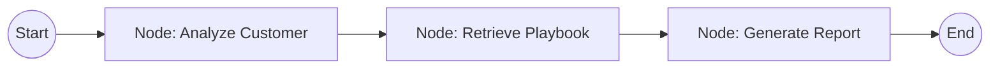

# Agent Workflow Documentation

The retention strategist is built using **LangGraph**, a framework for building stateful, multi-actor applications with LLMs.

## Node State Structure
The `AgentState` manages the lifecycle of the data as it passes through the graph:
- `customer_data`: Input profile.
- `churn_probability`: Score from the ML pipeline.
- `user_query`: Custom focus provided by the user.
- `retrieved_strategies`: Context from the FAISS database.
- `analysis`: Primary reasoning about risk themes.
- `final_report`: The generated professional output.

## Graph Definition (DAG)
The agent follows a deterministic Directed Acyclic Graph (DAG) for maximum reliability:

### 1. Analysis Node (`analyze_customer`)
- Proactively identifies the 2-3 most critical risk factors based on tenure, contract type, and service usage.
- Uses a "Reasoning Chain" to understand *why* the customer is likely to churn.

### 2. Retrieval Node (`retrieve_knowledge`)
- Queries the `vectorstore/db_faiss` using the analysis generated in Step 1.
- Retrieves the top 3 similarity-matched retention playbooks.
- Appends "Source" metadata to ensure alignment with Milestone 2 citation requirements.

### 3. Generation Node (`generate_report`)
- Synthesizes the analysis and retrieved strategies.
- Incorporates the `USER SPECIAL QUERY` to personalize the focus.
- Generates a structured output including Risk Summary, Action Plan, Email Draft, References, and Ethical Disclaimer.

## Fallback Mechanisms (Heuristic Mode)
If LLM providers fail or reach rate limits, the system automatically falls back to expert-coded heuristics to ensure the dashboard remains functional and compliant with project requirements.
