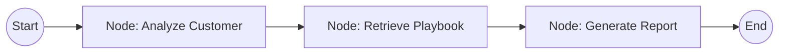

# Agent Workflow Documentation

The **Slip** retention strategist is powered by **LangGraph**, a framework designed for building stateful, multi-actor AI applications. This architecture allows our agent to maintain a "Chain of Thought" as it moves from raw data to a finalized strategic plan.

## The Agent's Memory (State Structure)
The `AgentState` acts as the system's memory, ensuring that context is preserved throughout the reasoning process:
- **customer_data**: The raw profile provided by the user.
- **churn_probability**: The risk score generated by our ML model.
- **user_query**: Specific instructions or focuses provided by the user.
- **retrieved_strategies**: Expert context pulled from our FAISS database.
- **analysis**: The agent's initial reasoning about specific risk themes.
- **final_report**: The polished, professional output delivered to the user.

## The Reasoning Workflow (DAG)
Our agent follows a deterministic Directed Acyclic Graph (DAG) for maximum reliability and logic:

### 1. Analysis Node (`analyze_customer`)
In this first step, the agent acts as a Senior Churn Analyst. It identifies the 2-3 most critical risk factors (like low tenure or contract volatility) to understand *why* the customer is likely to leave before searching for a solution.

### 2. Retrieval Node (`retrieve_knowledge`)
Using the analysis from Step 1, the agent queries our FAISS vector store. It retrieves the top 3 similarity-matched retention playbooks from our internal knowledge base, ensuring every recommendation is grounded in real-world business logic.

### 3. Generation Node (`generate_report`)
In the final step, the agent synthesizes the analysis and retrieved strategies. It incorporates any "Special Queries" from the user to generate a structured report including a risk summary, an intervention plan, and a ready-to-use email draft.

## Reliability via Heuristic Fallbacks
Production AI systems must be resilient. If the LLM providers (Gemini/Groq) hit rate limits or fail, **Slip** automatically switches to expert-coded heuristics. This ensures that a strategic plan is *always* generated, maintaining a seamless experience for the user.
