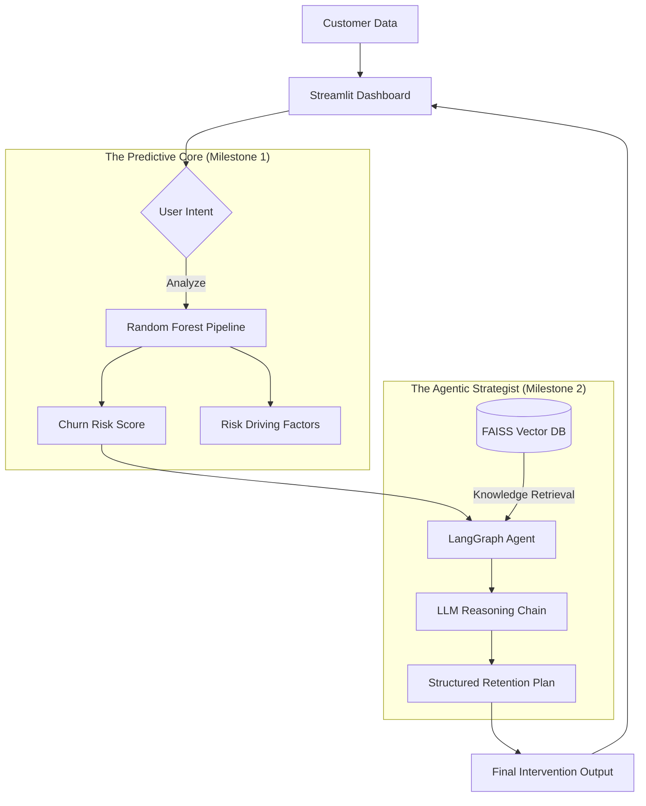

# System Architecture Overview

The **Slip Intelligence Platform** is designed with a progressive AI architecture. It seamlessly transitions from a classical machine learning core into a sophisticated, multi-agentic reasoning system.

## The Slip Blueprint

### Core Technologies
- **UI & UX**: Built with **Streamlit** for a responsive, interactive data experience.
- **Machine Learning**: Powered by a **Scikit-learn** Random Forest pipeline, optimized for high precision in churn detection.
- **Agentic Logic**: Orchestrated via **LangGraph**, enabling stateful, deterministic workflows that bridge data and strategy.
- **Knowledge Retrieval**: Utilizes a local **FAISS** vector database to store and retrieve industry-standard retention playbooks.
- **Natural Language Reasoning**: Primarily uses **Google Gemini Flash**, with integrated fallbacks to **Groq (Llama 3)** and **Mistral** to ensure 100% uptime.
