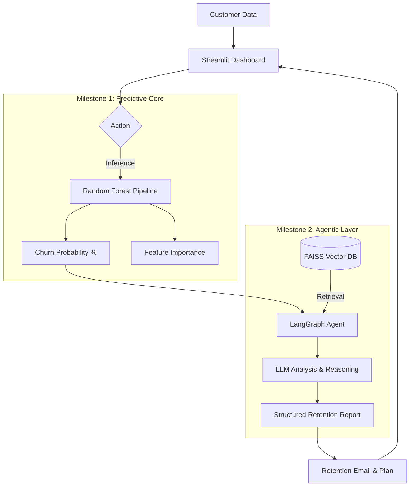

# Slip — Architecture & Agent Workflow

The **Slip Intelligence Platform** follows a progressive AI architecture, evolving from a classical machine learning pipeline into a multi-agentic reasoning system.

### Technical components:
- **UI Framework**: Streamlit
- **ML Core**: Scikit-learn (Random Forest Pipeline)
- **Agentic Framework**: LangGraph (Stateful Workflows)
- **Vector DB**: FAISS (Local storage of strategy playbooks)
- **Embedding Model**: `sentence-transformers/all-MiniLM-L6-v2`
- **LLM Reasoning**: Google Gemini Flash (with Groq/Mistral fallbacks)
